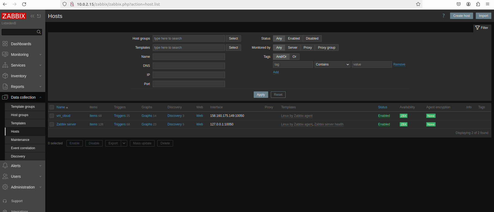
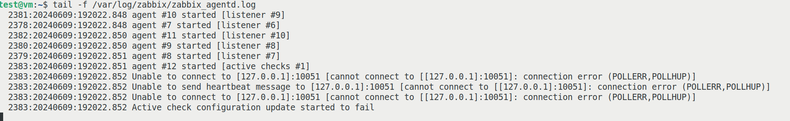
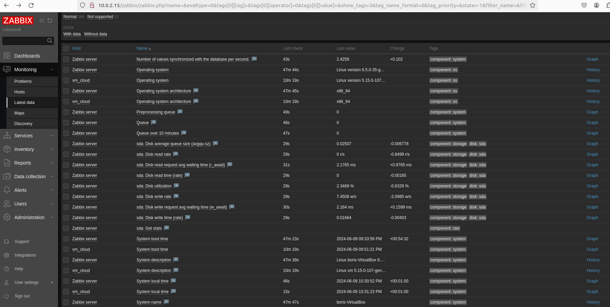

# Домашнее задание к занятию "Система мониторинга Zabbix" - `Lebedev Boris`


### Инструкция по выполнению домашнего задания

   1. Сделайте `fork` данного репозитория к себе в Github и переименуйте его по названию или номеру занятия, например, https://github.com/имя-вашего-репозитория/git-hw или  https://github.com/имя-вашего-репозитория/7-1-ansible-hw).
   2. Выполните клонирование данного репозитория к себе на ПК с помощью команды `git clone`.
   3. Выполните домашнее задание и заполните у себя локально этот файл README.md:
      - впишите вверху название занятия и вашу фамилию и имя
      - в каждом задании добавьте решение в требуемом виде (текст/код/скриншоты/ссылка)
      - для корректного добавления скриншотов воспользуйтесь [инструкцией "Как вставить скриншот в шаблон с решением](https://github.com/netology-code/sys-pattern-homework/blob/main/screen-instruction.md)
      - при оформлении используйте возможности языка разметки md (коротко об этом можно посмотреть в [инструкции  по MarkDown](https://github.com/netology-code/sys-pattern-homework/blob/main/md-instruction.md))
   4. После завершения работы над домашним заданием сделайте коммит (`git commit -m "comment"`) и отправьте его на Github (`git push origin`);
   5. Для проверки домашнего задания преподавателем в личном кабинете прикрепите и отправьте ссылку на решение в виде md-файла в вашем Github.
   6. Любые вопросы по выполнению заданий спрашивайте в чате учебной группы и/или в разделе “Вопросы по заданию” в личном кабинете.
   
Желаем успехов в выполнении домашнего задания!
   
### Дополнительные материалы, которые могут быть полезны для выполнения задания

1. [Руководство по оформлению Markdown файлов](https://gist.github.com/Jekins/2bf2d0638163f1294637#Code)

---

### Задание 1

`Приведите ответ в свободной форме........`

1.  sudo apt install postgresql
2.  wget https://repo.zabbix.com/zabbix/7.0/ubuntu/pool/main/z/zabbix-elease/zabbix-release_7.0-1+ubuntu22.04_all.deb
3.  sudo dpkg -i zabbix-release_7.0-1+ubuntu22.04_all.deb
4.  apt update
5.  apt install zabbix-server-pgsql zabbix-frontend-php php8.1-pgsql zabbix-apache-conf zabbix-sql-scripts zabbix-agent
6.  sudo -u postgres createuser --pwprompt zabbix
7.  sudo -u postgres createdb -O zabbix zabbix
8.  zcat /usr/share/zabbix-sql-scripts/postgresql/server.sql.gz | sudo -u zabbix psql zabbix
9.  sudo nano /etc/zabbix/zabbix_server.conf DBPassword=
10. systemctl restart zabbix-server zabbix-agent apache2
11. systemctl enable zabbix-server zabbix-agent apache2 
 


```
Поле для вставки кода...
....
....
....
....
```

`При необходимости прикрепитe сюда скриншоты
`


---

### Задание 2

`Приведите ответ в свободной форме........`

1. wget https://repo.zabbix.com/zabbix/7.0/ubuntu/pool/main/z/zabbix-release/zabbix-release_7.0-1+ubuntu22.04_all.deb
   dpkg -i zabbix-release_7.0-1+ubuntu22.04_all.deb
   apt update
   apt install zabbix-agent
   systemctl restart zabbix-agent
   systemctl enable zabbix-agent

```








....
....
....
....
```

`При необходимости прикрепитe сюда скриншоты
`


---


